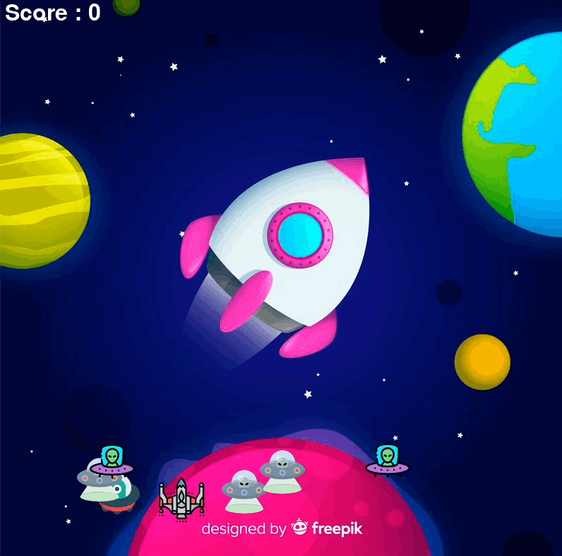
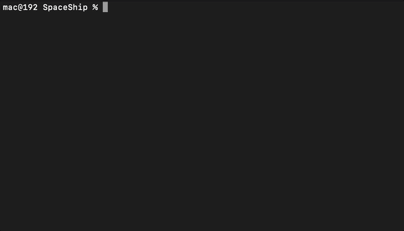

# SpaceShip
A simple game that imitates Space Invaders. Created with help of the pygame library.
## Table of Contents

- [Descripition](#description)

- [Demo](#demo)

- [Build guide](#build-guide)

- [Improvements](#improvements)

## Description
A game created as a project to teach the pygame library. I used the tutorial to learn the basics. Then I modified it by adding additional mechanics. The tutorial mentioned in this text: [link](https://www.youtube.com/watch?v=FfWpgLFMI7w)
## Demo
Gameplay:
 

In case that we fail to stop aliens from attacking, we lose.
 


## Build guide

You can use IDE or Terminal to build this project. Below I present the instructions on how to run the program using the terminal.

1. Clone the repository.
2. Unzip project.
3. Go to the folder where you unpacked this project.
4. Install pygame module.
```
 pip3 install pygame
```
or if you are using Windows OS try:
```
 pip install pygame
```
4. start main.py.
```
python3 main.py
```
A video showing the launch of the program.
 

## Improvements
Plans to add multiplayer in future releases.
